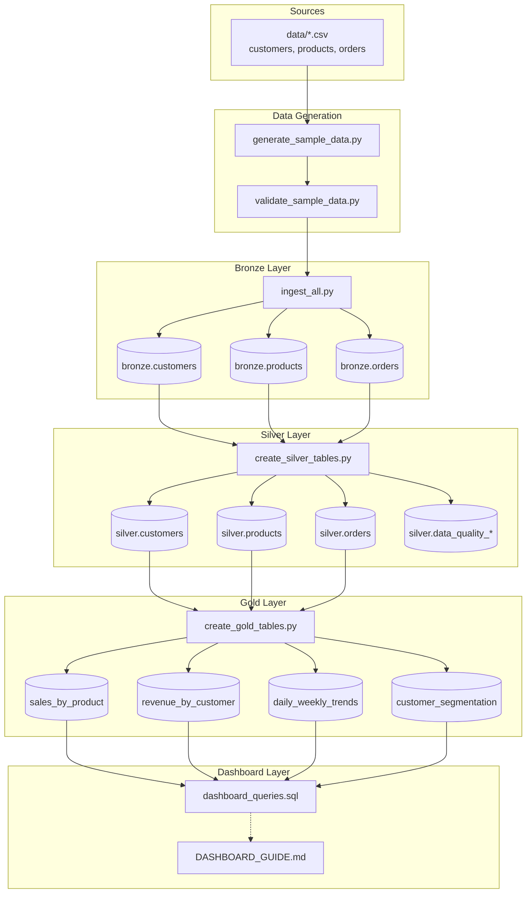

# E-Commerce Medallion Data Pipeline

A production-oriented **Bronze → Silver → Gold** analytics pipeline for e-commerce data. The project ingests intentionally imperfect CSV sources, lands raw data in Delta tables, applies measurable data-quality checks without deleting bad records, and produces business-ready Gold metrics for sales, revenue trends, and customer segmentation.

**Verification status (this repository):**

| Capability | Status |
|------------|--------|
| Local validation (PySpark + CSV) | **Verified** — 120 automated tests pass; local validation scripts produce reports in `data/` |
| Databricks Delta execution | **Documented, not verified here** — follow §17; no CI run against a live workspace in this repo |
| Databricks SQL Dashboard UI | **Not built** — SQL queries and setup guide only (`src/dashboard/`) |

---

## 1. Project overview

This repository implements a medallion lakehouse pipeline for three e-commerce entities: **customers**, **products**, and **orders**. Data flows from CSV sources through Bronze (raw ingest), Silver (validation and flagging), and Gold (aggregations) to dashboard-ready SQL queries.

Design goals:

- Preserve every source row for auditability
- Make quality failures **measurable** (counts per issue type)
- Build Gold analytics only from **valid** Silver records (`_is_valid = true`)
- Support reproducible local development and Databricks deployment

---

## 2. Business problem

An e-commerce organization needs trusted analytics despite imperfect operational data. Source files contain known defects: null emails, duplicate primary keys, null foreign keys, orphan references, and inconsistent order amounts. Stakeholders still need accurate KPIs (revenue, orders, customer segments) while data engineers need visibility into **what failed and why**.

This pipeline solves that by:

1. Ingesting all rows unchanged into Bronze
2. Flagging defects in Silver with `_quality_issues` and `_is_valid`
3. Aggregating Gold metrics from valid records only
4. Exposing KPI SQL for BI tools

---

## 3. Architecture



**Layer responsibilities**

| Layer | Storage | Responsibility |
|-------|---------|----------------|
| Bronze | Delta (`bronze.*`) | Raw ingest; add `_ingested_at`, `_source_file` |
| Silver | Delta (`silver.*`) | Five quality dimensions; flag — never delete |
| Gold | Delta (`gold.*`) | Business aggregations from valid Silver only |
| Dashboard | None (read-only SQL) | KPI and chart queries against Gold |

---

## 4. Technology stack

| Component | Technology |
|-----------|------------|
| Language | Python 3.10+ |
| Processing | PySpark |
| Storage | Delta Lake |
| Analytics SQL | Spark SQL / Databricks SQL |
| Orchestration | Python entry-point scripts per layer |
| Testing | `pytest` |
| AI-assisted development | Cursor (documented in `ai-prompts/`) |

---

## 5. Repository structure

```text
databricks-medallion-pipeline/
├── data/                          # Sample CSVs and validation reports
├── database/                      # Schema notes (DDL stubs)
├── src/
│   ├── data_generation/           # Sample data generator + validator
│   ├── bronze/                    # CSV → Delta ingest
│   ├── silver/                    # Quality framework + five dimensions
│   ├── gold/                      # SQL aggregations + reconciliation
│   ├── dashboard/                 # Dashboard SQL + setup guide
│   └── common/                    # Shared logging and config validation
├── tests/                         # Automated test suite (120 tests)
├── ai-prompts/                    # Cursor session log per layer
├── cursor-workflow/               # Spec, task breakdown, project context
├── ERROR_HANDLING.md              # Logging and exception strategy
├── data-model.md                  # Full entity schemas
├── design-notes.md                # Architecture deep-dive
├── data-quality-strategy.md       # DQ framework specification
└── requirements-analysis.md       # Formal requirements
```

---

## 6. Data model

Three related entities (see `data-model.md` for full detail):

| Entity | Primary key | Row count (sample) | Notes |
|--------|-------------|-------------------|-------|
| `customers` | `customer_id` | 10,010 | 10 duplicate rows injected |
| `products` | `product_id` | 500 | No intentional defects |
| `orders` | `order_id` | 100,020 | Partitioned by `order_date` in Bronze/Silver |

**Relationships**

- `orders.customer_id` → `customers.customer_id`
- `orders.product_id` → `products.product_id`

---

## 7. Sample data generation

Generate deterministic CSVs with a fixed random seed (default **42**):

```bash
python src/data_generation/generate_sample_data.py --seed 42 --output-dir data
```

Independent file-based validation (34 checks):

```bash
python src/data_generation/validate_sample_data.py --data-dir data --report data/VALIDATION_REPORT.md
```

The repository includes pre-generated `data/*.csv` files. Regenerate only when you need a fresh copy or are changing defect logic.

**Expected row counts**

| File | Rows |
|------|------|
| `customers.csv` | 10,010 |
| `products.csv` | 500 |
| `orders.csv` | 100,020 |

---

## 8. Intentional quality issues

Defects are injected by design and verified by tests and `validate_sample_data.py`:

| Defect | Count | Silver issue code |
|--------|-------|-------------------|
| NULL customer emails | 50 | `completeness:email_null` |
| Duplicate `customer_id` rows (extra) | 10 rows → 20 flagged | `uniqueness:duplicate_customer_id` |
| NULL `customer_id` on orders | 100 | `completeness:customer_id_null` |
| NULL `product_id` on orders | 200 | `completeness:product_id_null` |
| Invalid `customer_id` (800001–800050) | 50 | `referential:invalid_customer_id` |
| Invalid `product_id` (700001–700030) | 30 | `referential:invalid_product_id` |
| Duplicate `order_id` rows (extra) | 20 rows → 40 flagged | `uniqueness:duplicate_order_id` |

After Silver validation, approximately **420 order rows** are invalid and excluded from Gold aggregations. Products have **zero** intentional defects.

---

## 9. Bronze layer

**Purpose:** Ingest CSV files unchanged into Delta tables with ingestion metadata.

| Script | Target table |
|--------|--------------|
| `src/bronze/01_ingest_customers.py` | `bronze.customers` |
| `src/bronze/03_ingest_products.py` | `bronze.products` |
| `src/bronze/02_ingest_orders.py` | `bronze.orders` (partitioned by `order_date`) |
| `src/bronze/ingest_all.py` | All three entities |

**Bronze adds**

- `_ingested_at` (timestamp)
- `_source_file` (string)

**Input validation:** missing files, empty files, header/schema mismatch, malformed CSV (`FAILFAST`), row-count parity.

**Further reading:** `src/bronze/BRONZE_EXECUTION.md`

---

## 10. Silver layer

**Purpose:** Apply data quality checks; retain all Bronze rows; flag failures.

| Output table | Description |
|--------------|-------------|
| `silver.customers` | Validated customers + quality metadata |
| `silver.products` | Validated products + quality metadata |
| `silver.orders` | Validated orders + quality metadata |
| `silver.data_quality_metrics` | Entity pass/fail rollups |
| `silver.data_quality_summary` | Per-check failure counts |
| `silver.data_quality_results` | Row-level failure detail |

**Silver adds per entity**

- `_is_valid` (boolean)
- `_quality_issues` (array of issue codes)
- `_quality_status`, `_validated_at`, `_run_id`

**Processing order:** customers → products → orders (orders need valid customer/product IDs for referential checks).

**Further reading:** `src/silver/SILVER_ARCHITECTURE.md`

---

## 11. Quality checks

Five dimensions, implemented as separate modules in `src/silver/`:

| # | Dimension | Module | Examples |
|---|-----------|--------|----------|
| 1 | Completeness | `01_quality_completeness.py` | NULL email, NULL FKs |
| 2 | Uniqueness | `02_quality_uniqueness.py` | Duplicate primary keys |
| 3 | Type validation | `03_quality_type_validation.py` | Email format, allowed segments/categories |
| 4 | Referential integrity | `04_quality_referential_integrity.py` | Orphan `customer_id`, `product_id` |
| 5 | Business logic | `05_quality_business_logic.py` | `total_amount` vs `quantity × unit_price`, payment date rules |

**Important:** NULL foreign keys are completeness failures, not referential failures. Referential checks apply only when the FK value is present.

---

## 12. Gold layer

**Purpose:** Business-ready aggregations from **valid Silver data only**.

| Gold table | SQL script | Grain |
|------------|------------|-------|
| `gold.sales_by_product` | `01_sales_by_product.sql` | `product_id` |
| `gold.revenue_by_customer` | `02_revenue_by_customer.sql` | `customer_id` |
| `gold.daily_weekly_trends` | `03_daily_weekly_trends.sql` | `date` + `trend_grain` (DAILY/WEEKLY) |
| `gold.customer_segmentation` | `04_customer_segmentation.sql` | `segment_type` |

**Segmentation rules** (mutually exclusive, priority order):

1. **Inactive** — zero valid orders
2. **High-Value** — lifetime revenue ≥ $2,500
3. **Repeat** — ≥ 2 valid orders (not High-Value)
4. **One-Time** — exactly 1 valid order (not High-Value)

**Further reading:** `src/gold/GOLD_ARCHITECTURE.md`

---

## 13. Dashboard

**Repository deliverables (verified locally):**

- `src/dashboard/dashboard_queries.sql` — 12 named queries (4 KPIs + 3 required charts + supplementary)
- `src/dashboard/DASHBOARD_GUIDE.md` — visualization binding instructions
- `src/dashboard/validate_dashboard_local.py` — executes all queries against local Gold temp views

**Not verified:** Databricks SQL Dashboard UI creation. Follow `DASHBOARD_GUIDE.md` to build the dashboard manually in your workspace.

Local validation:

```bash
python src/dashboard/validate_dashboard_local.py --data-dir data --output-dir data
```

Report: `data/DASHBOARD_VALIDATION_REPORT.md`

---

## 14. Testing

**120 automated tests** (verified 2026-08-16 on Windows, Python 3.10.9, PySpark local):

```bash
# Full suite (~9 minutes; requires Java + PySpark)
python -m pytest tests/ -v

# Fast unit tests (no Spark)
python -m pytest tests/ -m unit -v

# By layer
python -m pytest tests/data_generation/ tests/bronze/ tests/silver/ tests/gold/ tests/dashboard/ tests/integration/ -v
```

| Area | Location |
|------|----------|
| Sample data + defects | `tests/data_generation/` |
| Bronze config + Spark read | `tests/bronze/` |
| Silver dimensions (positive + negative) | `tests/silver/` |
| Gold aggregations + reconciliation | `tests/gold/` |
| Dashboard SQL | `tests/dashboard/` |
| End-to-end pipeline | `tests/integration/` |
| Config validation | `tests/common/` |

See `tests/README.md` and `tests/TEST_RESULTS.md` for structure and latest results.

**Windows note:** Tests set `PYSPARK_PYTHON` to the current interpreter in `tests/conftest.py` to avoid driver/worker Python version mismatches.

---

## 15. Configuration

Configuration is externalized via environment variables and CLI flags. Invalid values raise `ConfigurationError` at load time (see `src/common/pipeline_utils.py`).

### Bronze

| Variable | Default | Description |
|----------|---------|-------------|
| `MEDALLION_CATALOG` | _(none)_ | Unity Catalog name |
| `MEDALLION_BRONZE_SCHEMA` | `bronze` | Bronze schema |
| `MEDALLION_SOURCE_BASE_PATH` | `data` | CSV directory (local or `dbfs:/`) |
| `MEDALLION_BRONZE_WRITE_MODE` | `overwrite` | Delta write mode |

### Silver

| Variable | Default | Description |
|----------|---------|-------------|
| `MEDALLION_CATALOG` | _(none)_ | Unity Catalog name |
| `MEDALLION_BRONZE_SCHEMA` | `bronze` | Bronze schema |
| `MEDALLION_SILVER_SCHEMA` | `silver` | Silver schema |
| `MEDALLION_SILVER_WRITE_MODE` | `overwrite` | Delta write mode |
| `MEDALLION_RUN_ID` | UTC timestamp | Validation run identifier |

### Gold

| Variable | Default | Description |
|----------|---------|-------------|
| `MEDALLION_CATALOG` | _(none)_ | Unity Catalog name |
| `MEDALLION_SILVER_SCHEMA` | `silver` | Silver schema |
| `MEDALLION_GOLD_SCHEMA` | `gold` | Gold schema |
| `MEDALLION_GOLD_WRITE_MODE` | `overwrite` | Delta write mode |

CLI flags (`--catalog`, `--write-mode`, etc.) override environment variables on all layers.

---

## 16. Local execution

Local development uses **CSV files + PySpark temp views** for Silver/Gold validation. Delta writes require Databricks or a local Delta setup.

### Prerequisites

```bash
pip install pytest pyspark
```

- Python 3.10+
- Java 8 or 11 (for PySpark)
- Clone the repository and `cd` into the project root

### Step-by-step (verified commands)

```bash
# 1. Optional: regenerate sample data
python src/data_generation/generate_sample_data.py --seed 42 --output-dir data
python src/data_generation/validate_sample_data.py --data-dir data --report data/VALIDATION_REPORT.md

# 2. Bronze static validation (no Spark Delta write)
python src/bronze/validate_bronze_static.py --source-base-path data

# 3. Silver quality validation → report
python src/silver/validate_silver_local.py --data-dir data --output-dir data

# 4. Gold build + validation → report
python src/gold/validate_gold_local.py --data-dir data --output-dir data

# 5. Gold independent reconciliation → report
python src/gold/reconcile_gold_local.py --data-dir data --output-dir data

# 6. Dashboard query validation → report
python src/dashboard/validate_dashboard_local.py --data-dir data --output-dir data

# 7. Full automated test suite
python -m pytest tests/ -v
```

### Expected local reports

| Report | Path |
|--------|------|
| Sample data validation | `data/VALIDATION_REPORT.md` |
| Silver quality | `data/SILVER_QUALITY_REPORT.md` |
| Gold validation | `data/GOLD_VALIDATION_REPORT.md` |
| Gold reconciliation | `data/GOLD_RECONCILIATION_REPORT.md` |
| Dashboard queries | `data/DASHBOARD_VALIDATION_REPORT.md` |

---

## 17. Databricks execution

> **Not verified in this repository.** The steps below are documented for deployment; run and verify in your own workspace.

### Prerequisites

1. Databricks workspace with Delta Lake
2. Unity Catalog (recommended) or Hive metastore
3. Cluster or serverless compute with PySpark
4. CSV files uploaded to DBFS or a Unity Catalog volume

### Upload CSVs

```bash
databricks fs cp data/customers.csv dbfs:/FileStore/medallion/data/customers.csv
databricks fs cp data/products.csv  dbfs:/FileStore/medallion/data/products.csv
databricks fs cp data/orders.csv    dbfs:/FileStore/medallion/data/orders.csv
```

### Run pipelines (in order)

```bash
# Bronze
python src/bronze/ingest_all.py \
  --catalog main \
  --source-base-path dbfs:/FileStore/medallion/data \
  --write-mode overwrite

# Silver
python src/silver/create_silver_tables.py \
  --catalog main \
  --write-mode overwrite

# Gold
python src/gold/create_gold_tables.py \
  --catalog main \
  --write-mode overwrite
```

### Verify in Databricks SQL

```sql
SELECT COUNT(*) FROM main.bronze.customers;   -- expected: 10010
SELECT COUNT(*) FROM main.bronze.products;    -- expected: 500
SELECT COUNT(*) FROM main.bronze.orders;      -- expected: 100020

SELECT COUNT(*) FROM main.silver.orders WHERE NOT _is_valid;  -- expected: ~420

SELECT segment_type, customer_count
FROM main.gold.customer_segmentation
ORDER BY customer_count DESC;
```

### Dashboard

1. Open `src/dashboard/dashboard_queries.sql` in Databricks SQL Editor
2. Create saved queries per `-- QUERY:` block
3. Follow `src/dashboard/DASHBOARD_GUIDE.md` to bind visualizations

---

## 18. Troubleshooting

| Symptom | Likely cause | Action |
|---------|--------------|--------|
| `BronzeSourceFileError` | CSV missing | Check `--source-base-path`; upload files to DBFS |
| `BronzeIngestionError` (header) | Column mismatch | Regenerate CSVs; compare headers to `src/bronze/schemas.py` |
| `BronzeIngestionError` (FAILFAST) | Malformed CSV value | Fix source file; do not cleanse in Bronze |
| `ConfigurationError` | Invalid write mode or missing local dir | Check env vars; see `ERROR_HANDLING.md` |
| PySpark worker crash (Windows) | Python version mismatch | Set `PYSPARK_PYTHON` and `PYSPARK_DRIVER_PYTHON` to your interpreter |
| Gold KPI 2× expected | Summing DAILY + WEEKLY trends | Filter `trend_grain = 'DAILY'` in dashboard queries |
| Segmentation missing Inactive | All valid customers have orders | Expected on sample data; see `debugging-notes.md` |
| `SilverValidationError` (Bronze table) | Bronze not run or wrong catalog | Run Bronze first; verify `--catalog` and schema names |

**Further reading:** `ERROR_HANDLING.md`, `debugging-notes.md`

---

## 19. Data quality reporting

After Silver runs (local or Databricks), quality metrics are available in:

| Artifact | Location |
|----------|----------|
| Entity metrics | `silver.data_quality_metrics` |
| Per-check summary | `silver.data_quality_summary` |
| Row-level failures | `silver.data_quality_results` |
| Local markdown report | `data/SILVER_QUALITY_REPORT.md` |

Generate the local report:

```bash
python src/silver/validate_silver_local.py --data-dir data --output-dir data
```

Gold reconciliation (independent alternate-path validation):

```bash
python src/gold/reconcile_gold_local.py --data-dir data --output-dir data
```

---

## 20. AI/Cursor workflow

This project was developed with Cursor using structured rules and session logs:

| Path | Purpose |
|------|---------|
| `.cursor/rules/medallion-pipeline.mdc` | Architecture and coding standards |
| `ai-prompts/` | Per-layer prompt, outcome, and files touched |
| `cursor-workflow/spec.md` | Technical specification |
| `cursor-workflow/task-breakdown.md` | Implementation checklist |
| `debugging-notes.md` | Issues encountered and resolutions |

When extending the pipeline, document major Cursor sessions in `ai-prompts/` per project rules.

---

## 21. Limitations

| Limitation | Detail |
|------------|--------|
| Databricks not CI-verified | Delta writes and UC permissions must be validated in your workspace |
| Dashboard UI not built | Only SQL queries and a setup guide are provided |
| `database/schema.sql` | Stub only; tables are created by pipeline scripts (`CREATE OR REPLACE TABLE`) |
| Local mode uses temp views | Silver/Gold local validators do not write Delta locally |
| Orphan valid orders | 597 valid orders reference invalid customers — included in product/trend Gold, excluded from customer Gold |
| No streaming | Batch CSV ingest only |
| No `requirements.txt` | Install `pytest` and `pyspark` manually; pin versions for your Databricks runtime |

---

## 22. Future improvements

- Add `requirements.txt` or `pyproject.toml` with pinned dependencies
- Complete `database/schema.sql` with full DDL
- Databricks Asset Bundles (DABs) for job orchestration
- CI pipeline running unit tests on every PR
- Scheduled Databricks Jobs for Bronze → Silver → Gold
- Databricks SQL Dashboard deployment and screenshot verification
- Data quality trend dashboard (Silver metrics over time)
- Incremental Bronze ingest (append mode + deduplication strategy)

---

## Additional documentation

| Document | Topic |
|----------|-------|
| [data-model.md](data-model.md) | Entity schemas and relationships |
| [design-notes.md](design-notes.md) | Architecture deep-dive |
| [data-quality-strategy.md](data-quality-strategy.md) | DQ framework |
| [requirements-analysis.md](requirements-analysis.md) | Formal requirements |
| [ERROR_HANDLING.md](ERROR_HANDLING.md) | Logging and exceptions |
| [tests/README.md](tests/README.md) | Test strategy |

---

## License and contributions

Internal / educational project. Do not change medallion layer responsibilities without team approval (see `.cursor/rules/medallion-pipeline.mdc`).
