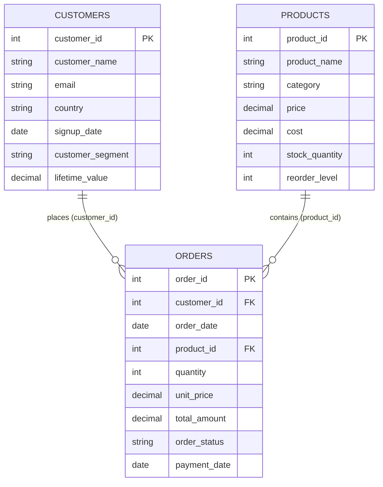

# Data Model

**Project:** E-Commerce Medallion Architecture Data Pipeline  
**Version:** 2.0  
**Status:** Design complete — implementation pending  
**Related:** `design-notes.md`, `requirements-analysis.md`

---

## 1. Entity Relationship Diagram

---

## 2. Source Layer — CSV Schema

These are the canonical column definitions for `data/*.csv` files.

### 2.1 `data/customers.csv`

| Column | Data Type | PK/FK | Required | Description |
|--------|-----------|-------|----------|-------------|
| `customer_id` | `INT` | **PK** | Yes | Unique customer identifier |
| `customer_name` | `STRING` | | Yes | Full name of customer |
| `email` | `STRING` | | Yes | Email address (completeness check target) |
| `country` | `STRING` | | Yes | Country of residence |
| `signup_date` | `DATE` | | Yes | Account creation date |
| `customer_segment` | `STRING` | | Yes | Segment label (e.g., Premium, Standard) — used in Gold segmentation |
| `lifetime_value` | `DECIMAL(12,2)` | | Yes | Historical customer value |

### 2.2 `data/products.csv`

| Column | Data Type | PK/FK | Required | Description |
|--------|-----------|-------|----------|-------------|
| `product_id` | `INT` | **PK** | Yes | Unique product identifier |
| `product_name` | `STRING` | | Yes | Product display name |
| `category` | `STRING` | | Yes | Product category |
| `price` | `DECIMAL(10,2)` | | Yes | Selling price |
| `cost` | `DECIMAL(10,2)` | | Yes | Unit cost |
| `stock_quantity` | `INT` | | Yes | Current inventory count |
| `reorder_level` | `INT` | | Yes | Minimum stock before reorder |

### 2.3 `data/orders.csv`

| Column | Data Type | PK/FK | Required | Description |
|--------|-----------|-------|----------|-------------|
| `order_id` | `INT` | **PK** | Yes | Unique order identifier |
| `customer_id` | `INT` | **FK** → `customers.customer_id` | Yes | Customer who placed the order |
| `order_date` | `DATE` | | Yes | Date order was placed — partition key |
| `product_id` | `INT` | **FK** → `products.product_id` | Yes | Product ordered |
| `quantity` | `INT` | | Yes | Units ordered (must be > 0) |
| `unit_price` | `DECIMAL(10,2)` | | Yes | Price per unit at time of order |
| `total_amount` | `DECIMAL(12,2)` | | Yes | Line total (business-logic check: ≈ quantity × unit_price) |
| `order_status` | `STRING` | | Yes | Status (e.g., Completed, Pending, Cancelled) |
| `payment_date` | `DATE` | | No | Date payment received (nullable) |

---

## 3. Relationships

| Relationship | Cardinality | Join Key | Description |
|--------------|-------------|----------|-------------|
| Customers → Orders | One-to-many | `customers.customer_id = orders.customer_id` | A customer places zero or more orders |
| Products → Orders | One-to-many | `products.product_id = orders.product_id` | A product appears in zero or more order lines |
| Orders → Customers | Many-to-one | `orders.customer_id` | Every order references one customer |
| Orders → Products | Many-to-one | `orders.product_id` | Every order line references one product |

### Referential Integrity Rules (Silver)

| FK Column | Parent Table | Parent Column | On Violation |
|-----------|--------------|---------------|--------------|
| `orders.customer_id` | `silver.customers` | `customer_id` | Flag `referential:invalid_customer_id` |
| `orders.product_id` | `silver.products` | `product_id` | Flag `referential:invalid_product_id` |

> NULL FK values are **completeness** failures, not referential failures. Referential checks apply only when FK is non-null.

---

## 4. Bronze Layer — Delta Tables

Bronze mirrors source CSV columns plus ingestion metadata. No type casting or cleansing.

### 4.1 `bronze.customers`

| Column | Data Type | Notes |
|--------|-----------|-------|
| `customer_id` | `INT` | PK (not enforced) |
| `customer_name` | `STRING` | As read from CSV |
| `email` | `STRING` | As read from CSV |
| `country` | `STRING` | As read from CSV |
| `signup_date` | `DATE` | As read from CSV |
| `customer_segment` | `STRING` | As read from CSV |
| `lifetime_value` | `DECIMAL(12,2)` | As read from CSV |
| `_ingested_at` | `TIMESTAMP` | Ingestion metadata |
| `_source_file` | `STRING` | Ingestion metadata |

**Partitioning:** None

### 4.2 `bronze.products`

| Column | Data Type | Notes |
|--------|-----------|-------|
| `product_id` | `INT` | PK (not enforced) |
| `product_name` | `STRING` | |
| `category` | `STRING` | |
| `price` | `DECIMAL(10,2)` | |
| `cost` | `DECIMAL(10,2)` | |
| `stock_quantity` | `INT` | |
| `reorder_level` | `INT` | |
| `_ingested_at` | `TIMESTAMP` | |
| `_source_file` | `STRING` | |

**Partitioning:** None

### 4.3 `bronze.orders`

| Column | Data Type | Notes |
|--------|-----------|-------|
| `order_id` | `INT` | PK (not enforced) |
| `customer_id` | `INT` | FK (not enforced) |
| `order_date` | `DATE` | **Partition column** |
| `product_id` | `INT` | FK (not enforced) |
| `quantity` | `INT` | |
| `unit_price` | `DECIMAL(10,2)` | |
| `total_amount` | `DECIMAL(12,2)` | |
| `order_status` | `STRING` | |
| `payment_date` | `DATE` | Nullable |
| `_ingested_at` | `TIMESTAMP` | |
| `_source_file` | `STRING` | |

**Partitioning:** `PARTITIONED BY (order_date)`

---

## 5. Silver Layer — Delta Tables

Silver contains typed business columns plus quality metadata. Row count equals Bronze.

### 5.1 `silver.customers`

| Column | Data Type | Notes |
|--------|-----------|-------|
| `customer_id` | `INT` | PK |
| `customer_name` | `STRING` | |
| `email` | `STRING` | Completeness check |
| `country` | `STRING` | |
| `signup_date` | `DATE` | Type validation |
| `customer_segment` | `STRING` | |
| `lifetime_value` | `DECIMAL(12,2)` | Business logic (≥ 0) |
| `_is_valid` | `BOOLEAN` | Quality flag |
| `_quality_issues` | `ARRAY<STRING>` | Issue codes |
| `_validated_at` | `TIMESTAMP` | |
| `_ingested_at` | `TIMESTAMP` | Carried from Bronze |
| `_source_file` | `STRING` | Carried from Bronze |

**Partitioning:** None

### 5.2 `silver.products`

| Column | Data Type | Notes |
|--------|-----------|-------|
| `product_id` | `INT` | PK |
| `product_name` | `STRING` | |
| `category` | `STRING` | |
| `price` | `DECIMAL(10,2)` | Business logic (> 0) |
| `cost` | `DECIMAL(10,2)` | Business logic (≥ 0) |
| `stock_quantity` | `INT` | Business logic (≥ 0) |
| `reorder_level` | `INT` | Business logic (≥ 0) |
| `_is_valid` | `BOOLEAN` | |
| `_quality_issues` | `ARRAY<STRING>` | |
| `_validated_at` | `TIMESTAMP` | |
| `_ingested_at` | `TIMESTAMP` | |
| `_source_file` | `STRING` | |

**Partitioning:** None

### 5.3 `silver.orders`

| Column | Data Type | Notes |
|--------|-----------|-------|
| `order_id` | `INT` | PK |
| `customer_id` | `INT` | FK → customers |
| `order_date` | `DATE` | **Partition column** |
| `product_id` | `INT` | FK → products |
| `quantity` | `INT` | Business logic (> 0) |
| `unit_price` | `DECIMAL(10,2)` | Business logic (> 0) |
| `total_amount` | `DECIMAL(12,2)` | Business logic (≈ qty × unit_price) |
| `order_status` | `STRING` | Allowed values check |
| `payment_date` | `DATE` | Nullable; type validation |
| `_is_valid` | `BOOLEAN` | |
| `_quality_issues` | `ARRAY<STRING>` | |
| `_validated_at` | `TIMESTAMP` | |
| `_ingested_at` | `TIMESTAMP` | |
| `_source_file` | `STRING` | |

**Partitioning:** `PARTITIONED BY (order_date)`

### 5.4 `silver.data_quality_summary`

| Column | Data Type | Notes |
|--------|-----------|-------|
| `run_id` | `STRING` | PK (composite) |
| `entity` | `STRING` | PK (composite) — customers, orders, products |
| `check_dimension` | `STRING` | completeness, uniqueness, type, referential, business |
| `issue_code` | `STRING` | PK (composite) |
| `issue_count` | `INT` | |
| `total_records` | `INT` | |
| `valid_records` | `INT` | |
| `invalid_records` | `INT` | |
| `reported_at` | `TIMESTAMP` | |

**Partitioning:** None (append or overwrite per run)

---

## 6. Gold Layer — Delta Tables

Gold tables contain business metrics only — no quality flags.

### 6.1 `gold.sales_by_product`

| Column | Data Type | PK | Description |
|--------|-----------|-----|-------------|
| `product_id` | `INT` | **PK** | Product identifier |
| `product_name` | `STRING` | | From `silver.products` |
| `category` | `STRING` | | From `silver.products` |
| `units_sold` | `BIGINT` | | `SUM(quantity)` from valid orders |
| `total_revenue` | `DECIMAL(14,2)` | | `SUM(total_amount)` from valid orders |
| `order_count` | `BIGINT` | | `COUNT(DISTINCT order_id)` |
| `avg_unit_price` | `DECIMAL(10,2)` | | `AVG(unit_price)` |
| `_refreshed_at` | `TIMESTAMP` | | Gold build timestamp |

**Source:** `silver.orders` (valid) JOIN `silver.products` (valid) ON `product_id`  
**Partitioning:** None

### 6.2 `gold.revenue_by_customer`

| Column | Data Type | PK | Description |
|--------|-----------|-----|-------------|
| `customer_id` | `INT` | **PK** | Customer identifier |
| `customer_name` | `STRING` | | From `silver.customers` |
| `country` | `STRING` | | From `silver.customers` |
| `customer_segment` | `STRING` | | From `silver.customers` |
| `total_revenue` | `DECIMAL(14,2)` | | `SUM(total_amount)` from valid orders |
| `order_count` | `BIGINT` | | `COUNT(DISTINCT order_id)` |
| `avg_order_value` | `DECIMAL(12,2)` | | `total_revenue / order_count` |
| `_refreshed_at` | `TIMESTAMP` | | |

**Source:** `silver.orders` (valid) JOIN `silver.customers` (valid) ON `customer_id`  
**Partitioning:** None

### 6.3 `gold.daily_weekly_trends`

| Column | Data Type | PK | Description |
|--------|-----------|-----|-------------|
| `period_date` | `DATE` | **PK** (composite) | Calendar date or week start |
| `period_type` | `STRING` | **PK** (composite) | `DAILY` or `WEEKLY` |
| `total_revenue` | `DECIMAL(14,2)` | | `SUM(total_amount)` |
| `order_count` | `BIGINT` | | `COUNT(DISTINCT order_id)` |
| `avg_order_value` | `DECIMAL(12,2)` | | `total_revenue / order_count` |
| `_refreshed_at` | `TIMESTAMP` | | |

**Source:** `silver.orders` (valid) — `order_date` for daily; `date_trunc('week', order_date)` for weekly  
**Partitioning:** `PARTITIONED BY (period_type)`

### 6.4 `gold.customer_segmentation`

| Column | Data Type | PK | Description |
|--------|-----------|-----|-------------|
| `customer_segment` | `STRING` | **PK** | Segment label |
| `customer_count` | `BIGINT` | | Distinct valid customers in segment |
| `total_revenue` | `DECIMAL(14,2)` | | Revenue from valid orders in segment |
| `avg_lifetime_value` | `DECIMAL(12,2)` | | `AVG(lifetime_value)` from valid customers |
| `avg_order_value` | `DECIMAL(12,2)` | | `total_revenue / order_count` |
| `order_count` | `BIGINT` | | Orders in segment |
| `_refreshed_at` | `TIMESTAMP` | | |

**Source:** `silver.customers` (valid) LEFT JOIN `silver.orders` (valid) ON `customer_id`  
**Partitioning:** None

---

## 7. Data Quality Checks by Entity

### Customers

| Dimension | Check | Issue Code |
|-----------|-------|------------|
| Completeness | `customer_id`, `customer_name`, `email`, `country`, `signup_date`, `customer_segment` not null | `completeness:<column>_null` |
| Completeness | **Assignment:** 50 NULL `email` | `completeness:email_null` |
| Uniqueness | No duplicate `customer_id` | `uniqueness:duplicate_customer_id` |
| Uniqueness | **Assignment:** 10 duplicate `customer_id` | `uniqueness:duplicate_customer_id` |
| Type | `customer_id` INT, `signup_date` valid DATE, `lifetime_value` DECIMAL | `type:<column>_invalid` |
| Business | `lifetime_value >= 0` | `business:negative_lifetime_value` |

### Products

| Dimension | Check | Issue Code |
|-----------|-------|------------|
| Completeness | `product_id`, `product_name`, `category`, `price` not null | `completeness:<column>_null` |
| Uniqueness | No duplicate `product_id` | `uniqueness:duplicate_product_id` |
| Type | Numeric columns castable | `type:<column>_invalid` |
| Business | `price > 0`, `cost >= 0`, `stock_quantity >= 0`, `reorder_level >= 0` | `business:<rule>` |

### Orders

| Dimension | Check | Issue Code |
|-----------|-------|------------|
| Completeness | `order_id`, `customer_id`, `product_id`, `order_date`, `quantity`, `unit_price`, `total_amount`, `order_status` not null | `completeness:<column>_null` |
| Completeness | **Assignment:** 100 NULL `customer_id`, 200 NULL `product_id` | `completeness:customer_id_null`, `completeness:product_id_null` |
| Uniqueness | No duplicate `order_id` | `uniqueness:duplicate_order_id` |
| Uniqueness | **Assignment:** 20 duplicate `order_id` | `uniqueness:duplicate_order_id` |
| Type | Date and numeric columns castable | `type:<column>_invalid` |
| Referential | `customer_id` exists in `silver.customers` | `referential:invalid_customer_id` |
| Referential | **Assignment:** 50 invalid `customer_id` | `referential:invalid_customer_id` |
| Referential | `product_id` exists in `silver.products` | `referential:invalid_product_id` |
| Referential | **Assignment:** 30 invalid `product_id` | `referential:invalid_product_id` |
| Business | `quantity > 0`, `unit_price > 0`, `total_amount ≈ quantity × unit_price` | `business:<rule>` |
| Business | `order_status` in allowed set | `business:invalid_order_status` |

---

## 8. Table Dependency Matrix

| Child Table | Parent Table(s) | Dependency Type |
|-------------|-----------------|-----------------|
| `bronze.customers` | `data/customers.csv` | Source ingest |
| `bronze.products` | `data/products.csv` | Source ingest |
| `bronze.orders` | `data/orders.csv` | Source ingest |
| `silver.customers` | `bronze.customers` | Validation |
| `silver.products` | `bronze.products` | Validation |
| `silver.orders` | `bronze.orders`, `silver.customers`, `silver.products` | Validation + FK |
| `silver.data_quality_summary` | All `silver.*` entity tables | Aggregation |
| `gold.sales_by_product` | `silver.orders`, `silver.products` | Analytics |
| `gold.revenue_by_customer` | `silver.orders`, `silver.customers` | Analytics |
| `gold.daily_weekly_trends` | `silver.orders` | Analytics |
| `gold.customer_segmentation` | `silver.customers`, `silver.orders` | Analytics |

---

## 9. Primary Keys and Foreign Keys Summary

| Table | Primary Key | Foreign Keys |
|-------|-------------|--------------|
| `customers` (all layers) | `customer_id` | — |
| `products` (all layers) | `product_id` | — |
| `orders` (all layers) | `order_id` | `customer_id` → customers; `product_id` → products |
| `gold.sales_by_product` | `product_id` | — |
| `gold.revenue_by_customer` | `customer_id` | — |
| `gold.daily_weekly_trends` | `period_date`, `period_type` | — |
| `gold.customer_segmentation` | `customer_segment` | — |
| `silver.data_quality_summary` | `run_id`, `entity`, `issue_code` | — |

> PK/FK constraints are **logical** (enforced by Silver validation), not physical Delta constraints.

---

*Last updated: 2026-08-15*
