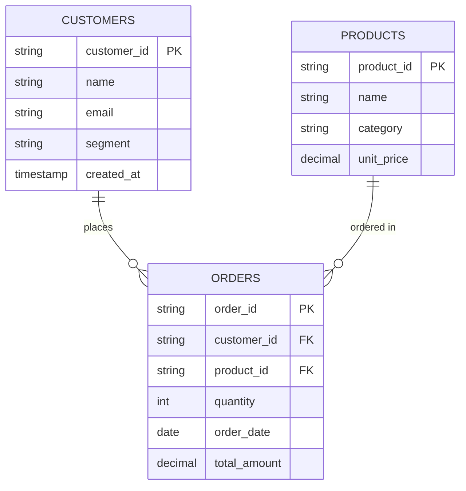

# Data Model

## Entity Relationship Diagram

## Layer Schemas

### Bronze

Mirrors CSV columns plus:

| Column | Type | Description |
|--------|------|-------------|
| `_ingested_at` | timestamp | UTC ingestion time |
| `_source_file` | string | Source CSV path |

### Silver

Bronze columns plus quality metadata:

| Column | Type | Description |
|--------|------|-------------|
| `_is_valid` | boolean | Passes all quality checks |
| `_quality_issues` | array&lt;string&gt; | List of failed check names |
| `_validated_at` | timestamp | Validation run timestamp |

### Gold (Planned)

| Table | Grain | Key Metrics |
|-------|-------|-------------|
| `gold.sales_by_product` | product | units_sold, revenue |
| `gold.revenue_by_customer` | customer | total_revenue, order_count |
| `gold.daily_weekly_trends` | day / week | revenue, order_count |
| `gold.customer_segmentation` | customer + segment | segment-level KPIs |

## Referential Integrity Rules

- `orders.customer_id` → `customers.customer_id`
- `orders.product_id` → `products.product_id`
