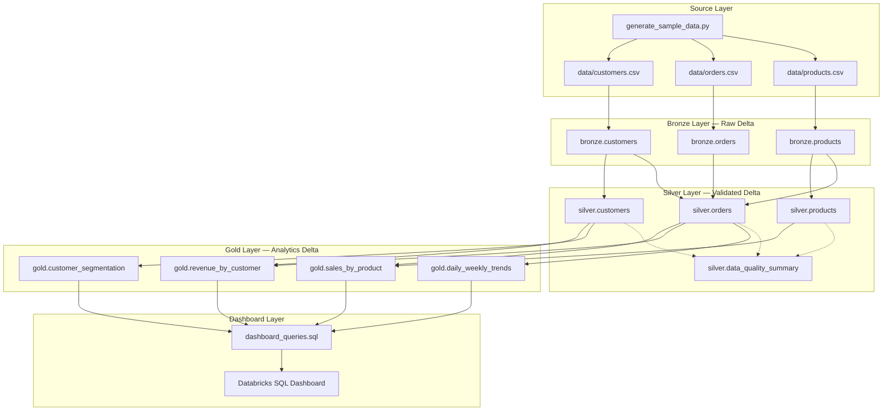
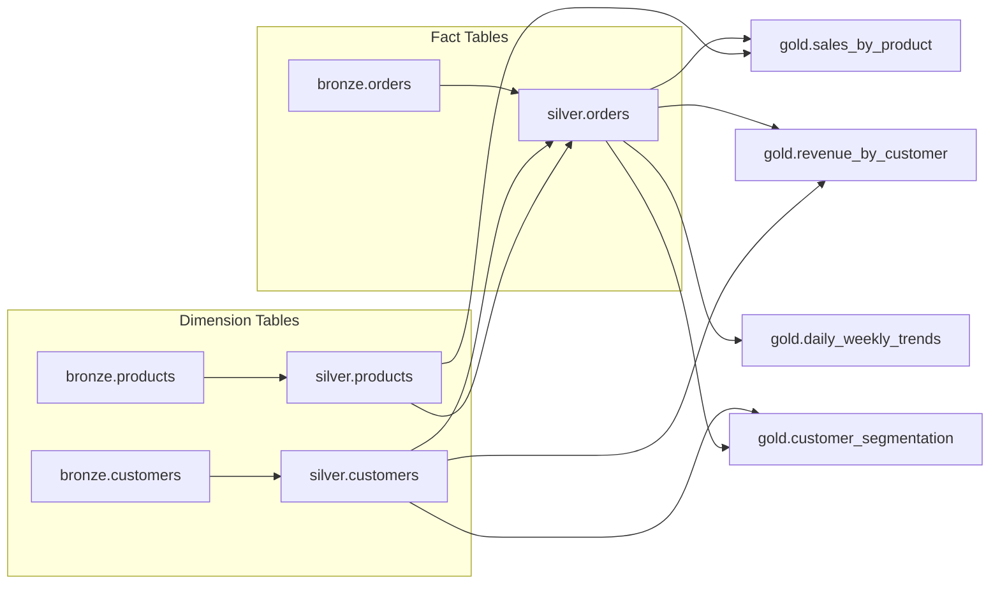

# Design Notes

**Project:** E-Commerce Medallion Architecture Data Pipeline  
**Version:** 2.0  
**Status:** Architecture & data model design complete — implementation pending  
**Related:** `data-model.md`, `requirements-analysis.md`, `cursor-workflow/spec.md`

---

## 1. Architecture Overview

The pipeline follows a strict **Medallion Architecture** on Databricks with Delta Lake storage. Data flows in one direction from CSV sources through Bronze, Silver, and Gold layers to a **Databricks SQL Dashboard**.



### Layer Summary

| Layer | Storage | Transformations | Consumer |
|-------|---------|-----------------|----------|
| **Source** | CSV files in `data/` | Synthetic data generation only | Bronze ingest |
| **Bronze** | Delta (`bronze.*`) | None (raw landing + metadata) | Silver |
| **Silver** | Delta (`silver.*`) | Quality checks + flags | Gold, DQ reporting |
| **Gold** | Delta (`gold.*`) | Business aggregations | Dashboard |
| **Dashboard** | Databricks SQL (no storage) | Visualization queries | Business users |

---

## 2. Source Layer

### Purpose

Provide the system-of-record CSV files that simulate an e-commerce operational export.

### Components

| File | Entity | Generator |
|------|--------|-----------|
| `data/customers.csv` | Customers | `src/data_generation/generate_sample_data.py` |
| `data/orders.csv` | Orders | `src/data_generation/generate_sample_data.py` |
| `data/products.csv` | Products | `src/data_generation/generate_sample_data.py` |

### Design Principles

- **Deterministic:** fixed random seed for reproducible datasets.
- **Intentionally imperfect:** ~700 problematic rows with assignment-specified defects (see `requirements-analysis.md` §6.4).
- **Schema contract:** column names and types defined in `data-model.md` §2.
- **No pipeline logic:** generation is a standalone pre-step, not part of Bronze/Silver/Gold runtime.

### Source → Bronze Contract

Bronze reads CSV files as-is. Type coercion and validation happen only in Silver. Bronze may store values as read (string representation from CSV) or with Spark-inferred types, but **must not apply business rules or drop rows**.

---

## 3. Bronze Layer

### Purpose

Raw landing zone. Ingest every row from every CSV into Delta Lake without quality filtering or business transformations.

### Tables

| Table | Source File | Primary Key |
|-------|-------------|-------------|
| `bronze.customers` | `data/customers.csv` | `customer_id` |
| `bronze.orders` | `data/orders.csv` | `order_id` |
| `bronze.products` | `data/products.csv` | `product_id` |

### Scripts

| Script | Responsibility |
|--------|----------------|
| `01_ingest_customers.py` | Load customers CSV → Delta |
| `02_ingest_orders.py` | Load orders CSV → Delta |
| `03_ingest_products.py` | Load products CSV → Delta |
| `ingest_all.py` | Orchestrate all three ingestions in dependency-neutral order |

### Bronze Metadata Columns

| Column | Type | Description |
|--------|------|-------------|
| `_ingested_at` | `TIMESTAMP` | UTC timestamp of ingestion run |
| `_source_file` | `STRING` | Full path or name of source CSV |

### Bronze Rules

1. **No quality checks** — duplicates, nulls, and invalid FKs are preserved.
2. **No deduplication** — every CSV row becomes one Delta row.
3. **No joins** — each entity ingested independently.
4. **Idempotent dev runs** — use `overwrite` mode per entity table (see §11).
5. **Log row counts** — log source path, rows read, rows written.

### Partitioning (Bronze)

| Table | Partition Column | Rationale |
|-------|------------------|-----------|
| `bronze.customers` | None | Small dimension table; full scan acceptable |
| `bronze.products` | None | Small dimension table |
| `bronze.orders` | `order_date` (DATE) | Fact table; enables partition pruning on date filters |

> For assignment-scale data volumes, partitioning on `bronze.orders` is optional but demonstrates production patterns. Implementation may use unpartitioned tables if volume is small; design recommends `order_date` partition for orders.

---

## 4. Silver Layer

### Purpose

Validate, type-cast, and flag data quality issues. Retain **all** Bronze rows — never delete intentionally bad records.

### Tables

| Table | Source | Primary Key |
|-------|--------|-------------|
| `silver.customers` | `bronze.customers` | `customer_id` |
| `silver.products` | `bronze.products` | `product_id` |
| `silver.orders` | `bronze.orders` | `order_id` |
| `silver.data_quality_summary` | Silver validation runs | `(run_id, entity, issue_code)` |

### Processing Order (Table Dependencies)

```text
1. silver.customers   ← bronze.customers
2. silver.products    ← bronze.products
3. silver.orders      ← bronze.orders + silver.customers + silver.products (for FK checks)
4. silver.data_quality_summary ← aggregated from all Silver entity validations
```

Dimensions (customers, products) must be validated **before** orders so referential integrity checks have parent key sets available.

### Quality Scripts

| # | Dimension | Script | Entity Scope |
|---|-----------|--------|--------------|
| 1 | Completeness | `01_quality_completeness.py` | All three |
| 2 | Uniqueness | `02_quality_uniqueness.py` | All three |
| 3 | Type validation | `03_quality_type_validation.py` | All three |
| 4 | Referential integrity | `04_quality_referential_integrity.py` | Orders only |
| 5 | Business logic | `05_quality_business_logic.py` | All three |

### Silver Metadata Columns

| Column | Type | Description |
|--------|------|-------------|
| `_is_valid` | `BOOLEAN` | `true` only when `_quality_issues` is empty |
| `_quality_issues` | `ARRAY<STRING>` | Machine-readable issue codes |
| `_validated_at` | `TIMESTAMP` | UTC timestamp of validation run |

### Silver Rules

1. **Row-count parity:** `COUNT(bronze.*) = COUNT(silver.*)` per entity.
2. **Flag all duplicates:** every row sharing a duplicate PK is flagged invalid.
3. **Compound issues:** a row may accumulate multiple issue codes.
4. **Typed columns:** cast to target types in Silver; failed casts add type-validation flags.
5. **Orchestrator:** `create_silver_tables.py` runs dimensions → orders → DQ summary.

### Partitioning (Silver)

Mirror Bronze: partition `silver.orders` by `order_date`; leave customers and products unpartitioned.

### Optional Views

| View | Definition |
|------|------------|
| `silver.customers_quarantine` | `WHERE _is_valid = false` |
| `silver.orders_quarantine` | `WHERE _is_valid = false` |
| `silver.products_quarantine` | `WHERE _is_valid = false` |

---

## 5. Gold Layer

### Purpose

Business-ready aggregations built from **valid Silver data** (`_is_valid = true`) for analytics and dashboard consumption.

### Tables

| Table | SQL Script | Grain | Primary Metrics |
|-------|------------|-------|-----------------|
| `gold.sales_by_product` | `01_sales_by_product.sql` | `product_id` | units_sold, total_revenue, order_count |
| `gold.revenue_by_customer` | `02_revenue_by_customer.sql` | `customer_id` | total_revenue, order_count, avg_order_value |
| `gold.daily_weekly_trends` | `03_daily_weekly_trends.sql` | `period_date`, `period_type` | revenue, order_count |
| `gold.customer_segmentation` | `04_customer_segmentation.sql` | `customer_segment` | customer_count, total_revenue, avg_lifetime_value |

### Gold Input Dependencies

```text
gold.sales_by_product        ← silver.orders (valid) JOIN silver.products (valid)
gold.revenue_by_customer     ← silver.orders (valid) JOIN silver.customers (valid)
gold.daily_weekly_trends     ← silver.orders (valid)
gold.customer_segmentation   ← silver.customers (valid) LEFT JOIN silver.orders (valid)
```

### Gold Rules

1. **Filter valid rows:** `WHERE _is_valid = true` on all Silver inputs (default).
2. **SQL-first:** business logic expressed in readable `.sql` files.
3. **Orchestrator:** `create_gold_tables.py` executes SQL scripts in order.
4. **Overwrite:** full rebuild per run (assignment batch pattern).
5. **No quality flags in Gold:** Gold columns are business-facing only.

### Partitioning (Gold)

| Table | Partition Column | Rationale |
|-------|------------------|-----------|
| `gold.sales_by_product` | None | One row per product |
| `gold.revenue_by_customer` | None | One row per customer |
| `gold.daily_weekly_trends` | `period_type` | Separates `DAILY` vs `WEEKLY` rows |
| `gold.customer_segmentation` | None | One row per segment |

---

## 6. Dashboard Layer

### Purpose

Expose Gold metrics to business users via **Databricks SQL Dashboard**.

### Components

| Artifact | Role |
|----------|------|
| `src/dashboard/dashboard_queries.sql` | Parameterized SQL against Gold tables |
| `src/dashboard/DASHBOARD_GUIDE.md` | Setup instructions for Databricks SQL Dashboard |

### Planned Visualizations

| Panel | Gold Source | Chart Type |
|-------|-------------|--------------|
| Top Products by Revenue | `gold.sales_by_product` | Bar chart |
| Top Customers by Revenue | `gold.revenue_by_customer` | Bar chart |
| Revenue Trend | `gold.daily_weekly_trends` | Line chart (daily) |
| Segment Performance | `gold.customer_segmentation` | Table / bar chart |

### Dashboard Rules

1. **Gold only** — no direct queries against Bronze or Silver.
2. **Read-only** — dashboard does not write data.
3. **Refresh aligned with pipeline** — schedule dashboard refresh after Gold build completes.

---

## 7. Data Flow

### End-to-End Flow

```text
Step 0:  generate_sample_data.py  →  data/*.csv
Step 1:  ingest_all.py            →  bronze.customers, bronze.orders, bronze.products
Step 2:  create_silver_tables.py  →  silver.customers, silver.products, silver.orders
                                     + silver.data_quality_summary
Step 3:  create_gold_tables.py    →  gold.sales_by_product, gold.revenue_by_customer,
                                     gold.daily_weekly_trends, gold.customer_segmentation
Step 4:  dashboard_queries.sql    →  Databricks SQL Dashboard visualizations
```

### Table Dependency Graph



---

## 8. Delta Lake Considerations

| Concern | Design Decision |
|---------|-----------------|
| **Format** | Delta Lake for all Bronze, Silver, and Gold tables |
| **Write mode** | `overwrite` for full batch refresh (assignment scope) |
| **Schema evolution** | `mergeSchema` enabled on Bronze ingest for dev flexibility; document column additions |
| **ACID** | Delta transactions ensure atomic table writes per layer run |
| **Time travel** | Available for debugging; not required for dashboard |
| **OPTIMIZE / VACUUM** | Optional post-run maintenance; not required for assignment |
| **Table properties** | Set `delta.autoOptimize.optimizeWrite = true` on orders tables (optional) |
| **Unity Catalog** | Tables registered as `{catalog}.bronze.*`, `{catalog}.silver.*`, `{catalog}.gold.*` |
| **Location** | Managed tables in Unity Catalog; path configurable via `database/setup-notes.md` |
| **Small files** | Coalesce before write on orders if partition count is high |

### Bronze-Specific

- Read CSV with `spark.read.option("header", true)`; preserve column order from source.
- Append metadata columns before write.

### Silver-Specific

- Full table overwrite per validation run maintains row-count parity with Bronze.
- `_quality_issues` stored as `ARRAY<STRING>` (native Delta type).

### Gold-Specific

- Created via `CREATE OR REPLACE TABLE ... AS SELECT` or DataFrame write overwrite.
- No slowly-changing-dimension logic required for assignment.

---

## 9. Error Handling

### Principles

1. **Fail fast on infrastructure errors** — missing files, permission denied, Spark failures.
2. **Never fail silently** — log context and re-raise or exit with non-zero status.
3. **Do not swallow data quality failures** — bad data is flagged in Silver, not hidden.
4. **Distinguish pipeline errors from data errors** — code exceptions vs `_is_valid = false`.

### Error Categories

| Category | Example | Handling |
|----------|---------|----------|
| **Source error** | CSV file not found | Log path; raise `FileNotFoundError`; abort Bronze run |
| **Ingest error** | Schema mismatch, corrupt CSV | Log file and row; raise `AnalysisException`; abort Bronze |
| **Validation error (data)** | NULL email, duplicate PK | Flag in `_quality_issues`; continue processing |
| **Referential error (data)** | Invalid `customer_id` on order | Flag in `_quality_issues`; continue processing |
| **Gold build error** | SQL syntax failure | Log SQL file name; raise; abort Gold run |
| **Config error** | Missing catalog name | Log variable; raise before pipeline starts |

### Pattern (Python)

```python
logger = logging.getLogger(__name__)

try:
    df = spark.read.csv(path, header=True)
except AnalysisException as exc:
    logger.error("Failed to read source file: %s", path, exc_info=True)
    raise
```

### Pipeline Exit Behavior

| Layer | On fatal error | On data quality issues |
|-------|----------------|------------------------|
| Bronze | Abort; no partial table publish | N/A |
| Silver | Abort on code/infra errors | Continue; flag rows; write DQ summary |
| Gold | Abort if SQL fails | N/A (invalid rows already excluded) |

---

## 10. Logging

### Standards

- Use Python `logging` module — **never** `print` for pipeline diagnostics.
- Log level: `INFO` for normal operations; `WARNING` for unexpected but handled conditions; `ERROR` for failures.
- Include: layer name, table name, row counts, duration, run timestamp.

### Required Log Events

| Event | Layer | Example Message |
|-------|-------|-----------------|
| Pipeline start | All | `Starting Bronze ingestion run_id=20260815-001` |
| File read | Bronze | `Read 5000 rows from data/orders.csv` |
| Table write | Bronze/Silver/Gold | `Wrote 5000 rows to bronze.orders` |
| Quality summary | Silver | `silver.orders: total=5000 valid=4300 invalid=700` |
| Issue breakdown | Silver | `Issue completeness:customer_id_null count=100` |
| Pipeline complete | All | `Bronze ingestion completed in 12.3s` |
| Fatal error | All | `Failed to ingest orders: <exception>` |

### Run Identifier

Each pipeline execution generates a `run_id` (e.g., `YYYYMMDD-HHMMSS`) propagated through logs and `silver.data_quality_summary`.

---

## 11. Data Quality Reporting

### Row-Level Flags (Silver Entity Tables)

Every Silver entity row carries `_is_valid`, `_quality_issues`, and `_validated_at`.

### Summary Table: `silver.data_quality_summary`

| Column | Type | Description |
|--------|------|-------------|
| `run_id` | `STRING` | Pipeline run identifier |
| `entity` | `STRING` | `customers`, `orders`, or `products` |
| `check_dimension` | `STRING` | completeness, uniqueness, type, referential, business |
| `issue_code` | `STRING` | e.g., `completeness:email_null` |
| `issue_count` | `INT` | Number of rows with this issue |
| `total_records` | `INT` | Total rows in entity |
| `valid_records` | `INT` | Rows where `_is_valid = true` |
| `invalid_records` | `INT` | Rows where `_is_valid = false` |
| `reported_at` | `TIMESTAMP` | When summary was written |

### Logged Metrics (per entity, per run)

| Metric | Target |
|--------|--------|
| `total_records` | Row count processed |
| `valid_records` | `_is_valid = true` count |
| `invalid_records` | `_is_valid = false` count |
| `issue_breakdown` | Dict of `issue_code → count` |
| **Assignment target** | `SUM(invalid_records)` ≈ **700** across all entities |

### Reporting Consumers

- Pipeline logs (stdout / Databricks driver logs)
- `silver.data_quality_summary` table (queryable)
- Optional: dashboard panel on DQ metrics (out of scope unless added later)

---

## 12. Naming Conventions

| Item | Convention | Example |
|------|------------|---------|
| Bronze tables | `bronze.<entity>` | `bronze.orders` |
| Silver tables | `silver.<entity>` | `silver.orders` |
| Gold tables | `gold.<metric>` | `gold.sales_by_product` |
| Quality flags | `_` prefix | `_is_valid`, `_quality_issues` |
| Issue codes | `<dimension>:<detail>` | `referential:invalid_customer_id` |
| Scripts | Numbered prefix | `01_ingest_customers.py` |

---

## 13. Technology Choices

| Concern | Choice | Rationale |
|---------|--------|-----------|
| Storage | Delta Lake | ACID, Databricks native, time travel |
| Bronze/Silver | PySpark | Flexible validation and orchestration |
| Gold | SQL + PySpark orchestrator | Transparent analytics logic |
| Dashboard | Databricks SQL Dashboard | Native integration with Gold Delta tables |
| Sample data | Python + `random.seed()` | Deterministic, reproducible defects |
| Catalog | Unity Catalog (recommended) | Governance, lineage, permissions |

---

## 14. Change Control

> **Architectural changes require explicit approval.** Document rationale in this file before implementing.

Approved architecture (locked):

```text
Source CSV → Bronze → Silver → Gold → Databricks SQL Dashboard
```

Layers must not be skipped, merged, or reordered without approval.

---

*Last updated: 2026-08-15*
