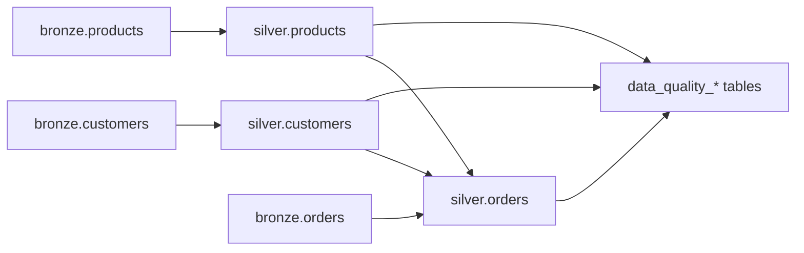

# Silver Layer Architecture

## Purpose

The Silver layer validates Bronze data **without removing or correcting** intentional
quality defects. Every source row is retained; failures are flagged with metadata
columns and persisted to quality reporting tables.

## Processing Order



1. **customers** — dimension; no upstream Silver dependencies
2. **products** — dimension; no upstream Silver dependencies
3. **orders** — requires validated `silver.customers` and `silver.products` for referential checks
4. **metrics tables** — aggregated after all entities complete

## Framework Design

| Component | Responsibility |
|-----------|----------------|
| `quality_framework.py` | `QualityCheck`, `QualityContext`, `apply_checks_to_dataframe()`, `finalize_silver_entity()` |
| `check_helpers.py` | Reusable builders for completeness, type, uniqueness, referential, business rules |
| `01`–`05_quality_*.py` | Dimension modules exposing `prepare()` and `get_checks()` |
| `quality_engine.py` | Orchestration, Bronze reads, Delta writes, row-count parity |
| `metrics.py` | Entity metrics and per-check summary rollups |

### Check execution model

1. Each dimension module may add temporary columns in `prepare()` (e.g. duplicate counts, FK existence flags).
2. All checks are collected and applied in a **single pass** so `_quality_issues` accumulates every failure code.
3. Temporary columns are dropped before Silver metadata is finalized.
4. Row-level failure detail is unioned into `silver.data_quality_results`.

### Silver entity columns (appended)

| Column | Description |
|--------|-------------|
| `_quality_issues` | `array<string>` of issue codes (e.g. `completeness:email_null`) |
| `_is_valid` | `true` when `_quality_issues` is empty |
| `_quality_status` | `VALID` or `INVALID` |
| `_validated_at` | UTC timestamp of the validation run |
| `_run_id` | Correlates all tables in a pipeline execution |

Bronze metadata (`_ingested_at`, `_source_file`) is preserved unchanged.

## Quality Result Schema

Each failed check produces a row in `silver.data_quality_results`:

| Field | Description |
|-------|-------------|
| `row_identifier` | String form of the entity primary key |
| `check_id` | Stable check identifier (e.g. `CMP-CUST-004`) |
| `check_name` | Human-readable check label |
| `check_dimension` | completeness / uniqueness / type_validation / referential_integrity / business_logic |
| `check_status` | `FAIL` for detail rows (pass rows are not stored) |
| `quality_result` | `FAIL` |
| `failure_reason` | Static explanation of the rule |
| `validated_at` | Run timestamp |

## Metrics Tables

### `silver.data_quality_metrics`

Entity-level rollup:

- `total_rows`, `passed_rows`, `failed_rows`
- `pass_percentage`, `fail_percentage`

### `silver.data_quality_summary`

Per-check rollup:

- `issue_count`, `issue_rate_pct`, `check_pass_rate_pct`
- Entity-level `total_records`, `valid_records`, `invalid_records` repeated per check row

## Architectural Decisions

| Decision | Rationale |
|----------|-----------|
| **No record deletion** | Silver must measure defects; cleansing belongs downstream (Gold filters `_is_valid = true` by default). |
| **Flag all duplicate PK rows** | Every row sharing a duplicated key is invalid, not just the “extra” copy. |
| **Skip referential checks on NULL FKs** | NULL foreign keys are completeness failures; referential rules apply only when FK is present. |
| **Match parent rows regardless of validity** | Orphan detection uses all `silver.customers` / `silver.products` rows so invalid parents are still resolvable keys. |
| **Single apply pass** | Avoids overwriting `_quality_issues` across dimensions; keeps logic deterministic. |
| **Deterministic run_id** | Configurable via `MEDALLION_RUN_ID` for reproducible test runs. |
| **Typed Bronze as source of truth** | Type checks treat NULL on required typed columns as `type:*_invalid`; malformed CSV values surface as NULL at Bronze ingest. |
| **Business rule tolerance** | `total_amount` compared to `quantity * unit_price` within `$0.01` (`AMOUNT_TOLERANCE`). |

## Configuration

| Variable | Default | Purpose |
|----------|---------|---------|
| `MEDALLION_CATALOG` | _(none)_ | Unity Catalog name |
| `MEDALLION_BRONZE_SCHEMA` | `bronze` | Bronze schema |
| `MEDALLION_SILVER_SCHEMA` | `silver` | Silver schema |
| `MEDALLION_SILVER_WRITE_MODE` | `overwrite` | Delta write mode |
| `MEDALLION_RUN_ID` | UTC timestamp | Validation run identifier |

## Execution

```bash
# After Bronze ingest on Databricks
python src/silver/create_silver_tables.py \
  --catalog main \
  --bronze-schema bronze \
  --silver-schema silver
```

## Testing

Local unit tests (`tests/test_silver_quality.py`) validate the framework against
generated CSV data using in-memory Spark DataFrames — no Delta dependency required
for check logic tests.
